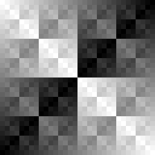

- [Cricket Introduction](#org61cd912)
- [Coherent Noise](#org9a003d0)
- [API](#orgc793bc1)
  - [Generators](#org5a1efe2)
  - [Modifiers](#org20bd21f)
  - [Map](#orgedea447)
- [Glossary](#org69afa39)
- [References](#org45acdff)
- [Prototyping](#orgff748c3)
  - [Org Mode Code Block Examples](#orga32525c)
  - [Org Mode Wisdom](#org36204b8)


<a id="org61cd912"></a>

# Cricket Introduction


<a id="org9a003d0"></a>

# Coherent Noise


<a id="orgc793bc1"></a>

# API


<a id="org5a1efe2"></a>

## Generators


### Perlin

1.  Function: **(perlin-1d &key seed)**

    1.  Description

            Construct a sampler that, when sampled, outputs 1-dimensional Perlin Improved noise values
            ranging from -1.0 to 1.0.

            `seed`: A string used to seed the random number generator for this sampler, or NIL. If a seed is not
            supplied, one will be generated automatically which will negatively affect the reproducibility of
            the noise (optional, default: NIL).

    2.  Example

        TBD

2.  Function: **(perlin-2d &key seed)**

    1.  Description

            Construct a sampler that, when sampled, outputs 2-dimensional Perlin Improved noise values
            ranging from -1.0 to 1.0.

            `seed`: A string used to seed the random number generator for this sampler, or NIL. If a seed is not
            supplied, one will be generated automatically which will negatively affect the reproducibility of
            the noise (optional, default: NIL).

    2.  Example

        TBD

3.  Function: **(perlin-3d &key seed)**

    1.  Description

            Construct a sampler that, when sampled, outputs 3-dimensional Perlin Improved noise values
            ranging from -1.0 to 1.0.

            `seed`: A string used to seed the random number generator for this sampler, or NIL. If a seed is not
            supplied, one will be generated automatically which will negatively affect the reproducibility of
            the noise (optional, default: NIL).

    2.  Example

        TBD

4.  Function: **(perlin-4d &key seed)**

    1.  Description

            Construct a sampler that, when sampled, outputs 4-dimensional Perlin Improved noise values
            ranging from -1.0 to 1.0.

            `seed`: A string used to seed the random number generator for this sampler, or NIL. If a seed is not
            supplied, one will be generated automatically which will negatively affect the reproducibility of
            the noise (optional, default: NIL).

    2.  Example

        TBD


### Simplex

1.  Function: **(simplex-1d &key seed)**

    1.  Description

            Construct a sampler that, when sampled, outputs 1-dimensional Simplex noise values ranging from
            -1.0 to 1.0.

            `seed`: A string used to seed the random number generator for this sampler, or NIL. If a seed is not
            supplied, one will be generated automatically which will negatively affect the reproducibility of
            the noise (optional, default: NIL).

    2.  Example

        TBD

2.  Function: **(simplex-2d &key seed)**

    1.  Description

            Construct a sampler that, when sampled, outputs 2-dimensional Simplex noise values ranging from
            -1.0 to 1.0.

            `seed`: A string used to seed the random number generator for this sampler, or NIL. If a seed is not
            supplied, one will be generated automatically which will negatively affect the reproducibility of
            the noise (optional, default: NIL).

    2.  Example

        TBD

3.  Function: **(simplex-3d &key seed)**

    1.  Description

            Construct a sampler that, when sampled, outputs 3-dimensional Simplex noise values ranging from
            -1.0 to 1.0.

            `seed`: A string used to seed the random number generator for this sampler, or NIL. If a seed is not
            supplied, one will be generated automatically which will negatively affect the reproducibility of
            the noise (optional, default: NIL).

    2.  Example

        TBD

4.  Function: **(simplex-4d &key seed)**

    1.  Description

            Construct a sampler that, when sampled, outputs 4-dimensional Simplex noise values ranging from
            -1.0 to 1.0.

            `seed`: A string used to seed the random number generator for this sampler, or NIL. If a seed is not
            supplied, one will be generated automatically which will negatively affect the reproducibility of
            the noise (optional, default: NIL).

    2.  Example

        TBD


### Open-Simplex

1.  Function: **(open-simplex-2d &key seed)**

    1.  Description

            Construct a sampler that, when sampled, outputs 2-dimensional OpenSimplex noise values ranging
            from -1.0 to 1.0.

            `seed`: A string used to seed the random number generator for this sampler, or NIL. If a seed is not
            supplied, one will be generated automatically which will negatively affect the reproducibility of
            the noise (optional, default: NIL).

    2.  Example

        TBD

2.  Function: **(open-simplex-3d \*key seed)**

    1.  Description

            Construct a sampler that, when sampled, outputs 3-dimensional OpenSimplex noise values ranging
            from -1.0 to 1.0.

            `seed`: A string used to seed the random number generator for this sampler, or NIL. If a seed is not
            supplied, one will be generated automatically which will negatively affect the reproducibility of
            the noise (optional, default: NIL).

    2.  Example

        TBD

3.  Function: **(open-simplex-4d &key seed)**

    1.  Description

            Construct a sampler that, when sampled, outputs 4-dimensional OpenSimplex noise values ranging
            from -1.0 to 1.0.

            `seed`: A string used to seed the random number generator for this sampler, or NIL. If a seed is not
            supplied, one will be generated automatically which will negatively affect the reproducibility of
            the noise (optional, default: NIL).

    2.  Example

        TBD

4.  Function: **(open-simplex2f-2d &key seed (orientation :standard))**

    1.  Description

            Construct a sampler that, when sampled, outputs 2-dimensional OpenSimplex2F noise values ranging
            from -1.0 to 1.0.

            `seed`: A string used to seed the random number generator for this sampler, or NIL. If a seed is not
            supplied, one will be generated automatically which will negatively affect the reproducibility of
            the noise (optional, default: NIL).

            `orientation`: One of `:standard` or `:x/y`, denoting the orientation of the lattice. `:x/y` has the
            Y axis pointing down the main diagonal, which might be more suitable for a game where Y is
            vertical (optional, default: `:standard`).

    2.  Example

        TBD

5.  Function: **(open-simplex2f-3d &key seed (orientation :standard))**

    1.  Description

            Construct a sampler that, when sampled, outputs 3-dimensional OpenSimplex2F noise values ranging
            from -1.0 to 1.0.

            `seed`: A string used to seed the random number generator for this sampler, or NIL. If a seed is not
            supplied, one will be generated automatically which will negatively affect the reproducibility of
            the noise (optional, default: NIL).

            `orientation`: One of `:standard`, `:xy/z`, or `:xz/y`, denoting the orientation of the lattice.
            `:xy/z` has better visual isotropy in XY, and `:xz/y` has better visual isotropy in XZ (optional,
            default: `:standard`).

    2.  Example

        TBD

6.  Function: **(open-simplex2f-4d &key seed (orientation :standard))**

    1.  Description

            Construct a sampler that, when sampled, outputs 4-dimensional OpenSimplex2F noise values ranging
            from -1.0 to 1.0.

            `seed`: A string used to seed the random number generator for this sampler, or NIL. If a seed is not
            supplied, one will be generated automatically which will negatively affect the reproducibility of
            the noise (optional, default: NIL).

            `orientation`: One of `:standard`, `:xy/zw`, `:xz/yw`, or `:xyz/w`, denoting the orientation of the
            lattice. `:xy/zw` is recommended for 3D terrain where X/Y or Z/W are horizontal. `:xz/yw` is
            recommended for 3D terrain where X/Z or Y/W are horizontal. `:xyz/w` is recommended for time-varied
            animations of 3D objects, where W is time (optional, default: `:standard`).

    2.  Example

        TBD

7.  Function: **(open-simplex2s-2d &key seed (orientation :standard))**

    1.  Description

            Construct a sampler that, when sampled, outputs 2-dimensional OpenSimplex2S noise values ranging
            from -1.0 to 1.0.

            `seed`: A string used to seed the random number generator for this sampler, or NIL. If a seed is not
            supplied, one will be generated automatically which will negatively affect the reproducibility of
            the noise (optional, default: NIL).

            `orientation`: One of `:standard` or `:x/y`, denoting the orientation of the lattice. `:x/y` has the
            Y axis pointing down the main diagonal, which might be more suitable for a game where Y is
            vertical (optional, default: `:standard`).

    2.  Example

        TBD

8.  Function: **(open-simplex2s-3d &key seed (orientation :standard))**

    1.  Description

            Construct a sampler that, when sampled, outputs 3-dimensional OpenSimplex2S noise values ranging
            from -1.0 to 1.0.

            `seed`: A string used to seed the random number generator for this sampler, or NIL. If a seed is not
            supplied, one will be generated automatically which will negatively affect the reproducibility of
            the noise (optional, default: NIL).

            `orientation`: One of `:standard`, `:xy/z`, or `:xz/y`, denoting the orientation of the lattice.
            `:xy/z` has better visual isotropy in XY, and `:xz/y` has better visual isotropy in XZ (optional,
            default: `:standard`).

    2.  Example

        TBD

9.  Function: **(open-simplex2s-4d &key seed (orientation :standard))**

    1.  Description

            Construct a sampler that, when sampled, outputs 4-dimensional OpenSimplex2S noise values ranging
            from -1.0 to 1.0.

            `seed`: A string used to seed the random number generator for this sampler, or NIL. If a seed is not
            supplied, one will be generated automatically which will negatively affect the reproducibility of
            the noise (optional, default: NIL).

            `orientation`: One of `:standard`, `:xy/zw`, `:xz/yw`, or `:xyz/w`, denoting the orientation of the
            lattice. `:xy/zw` is recommended for 3D terrain where X/Y or Z/W are horizontal. `:xz/yw` is
            recommended for 3D terrain where X/Z or Y/W are horizontal. `:xyz/w` is recommended for time-varied
            animations of 3D objects, where W is time (optional, default: `:standard`).

    2.  Example

        TBD


### Value

1.  value-2d

2.  value-3d


### Cellular

1.  cellular-2d

2.  cellular-3d


### Cylinders

1.  cylinders-3d


### Spheres

1.  spheres-3d


### Checker

1.  checker-2d


### Constant

1.  constant


### FBM: Fractal Brownian Motion

1.  fbm-2d

2.  fbm-3d

3.  fbm-4d


### Billow

1.  billow-2d

2.  billow-3d

3.  billow-4d


### Multifractal

1.  multifractal-2d

2.  multifractal-3d

3.  multifractal-4d


### Hybrid-Multifractal

1.  hybrid-multifractal-2d

2.  hybrid-multifractal-3d

3.  hybrid-multifractal-4d


### Ridged-Multifractal

1.  ridged-multifractal-2d

2.  ridged-multifractal-3d

3.  ridged-multifractal-4d


<a id="org20bd21f"></a>

## Modifiers


### +


### -


### \*


### /


### abs


### blend


### cache


### clamp


### curve


### displace


### expt


### fractalize


### max


### negate


### power


### rotate


### scale


### select


### strengthen


### terrace


### translate


### turbulance


### uniform-scale


<a id="orgedea447"></a>

## Map


### define-gradient


### get-image-pixel


### image

1.  image-height

2.  image-width

3.  image-data


### make-map

1.  map-data

2.  map-height

3.  map-value

4.  map-width


### render-map


### write-image


<a id="org69afa39"></a>

# Glossary


<a id="org45acdff"></a>

# References


<a id="orgff748c3"></a>

# Prototyping

Remove this entire section when the org more docs are complete.


<a id="orga32525c"></a>

## Org Mode Code Block Examples

This is an example of how to configure org-mode so that when I execute a block of common lisp the image it generates is places realtime inlined into the org document as appropriate.

```shell
echo "Hello world"
```

```lisp
(ql:quickload :cricket)
(defpackage #:my-package
  (:local-nicknames (#:c #:cricket))
  (:use #:cl))
(in-package #:my-package) ;; <- doesn't affect repl!
```

```lisp
(c:-> (c:checker-2d :seed "example")
  ;;(c:uniform-scale 1/4)
  (c:fractalize :fbm :octaves 3)
  (c:make-map :width 256 :height 256)
  (c:render-map)
  (c:write-image arg))
```



Example text.

```lisp
(c:-> (c:perlin-3d :seed "example")
  (c:uniform-scale 1.5)
  (c:fractalize :fbm :frequency 1.3 :octaves 6 :lacunarity 3 :persistence 0.22)
  (c:turbulence (c:open-simplex-3d :seed "foo") :power 1.2 :roughness 4)
  (c:make-map :width 256 :height 256)
  (c:render-map :gradient :terrain)
  (c:write-image arg))
```


Documentation retrival test:

**(perlin-2d &key seed)**

    Construct a sampler that, when sampled, outputs 2-dimensional Perlin Improved noise values
    ranging from -1.0 to 1.0.

    `seed`: A string used to seed the random number generator for this sampler, or NIL. If a seed is not
    supplied, one will be generated automatically which will negatively affect the reproducibility of
    the noise (optional, default: NIL).


<a id="org36204b8"></a>

## Org Mode Wisdom


### <https://www.gnu.org/software/emacs/refcards/pdf/orgcard.pdf>


### <https://orgmode.org/worg/orgcard.html>


### <https://orgmode.org/manual/Variable-Index.html>


### C-c C-x C-v - org-toggle-inline-images

Used to toggle all inline images on and off.


### C-c C-v b - org-babel-execute-buffer.

Execute all code blocks in the buffer and update the results.