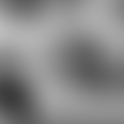

- [Cricket Introduction](#orgfeb334d)
- [Coherent Noise](#org1ecd092)
- [API](#orge3955c3)
  - [Generators](#org6a411c2)
  - [Modifiers](#orgf1494de)
  - [Map](#org0a8e60c)
- [Glossary](#org53b5c23)
- [References](#org7f83cb0)
- [Prototyping](#orga12cc2a)
  - [Org Mode Code Block Examples](#org1adde6b)
  - [Org Mode Wisdom](#org013e2c3)


<a id="orgfeb334d"></a>

# Cricket Introduction

This document describes the `cricket` coherent noise library. It is in the process of being written.


<a id="org1ecd092"></a>

# Coherent Noise


<a id="orge3955c3"></a>

# API

Cricket's API is split into three main pieces: Generators which generate a source signal of noise, Modifiers which mutate, combine, or otherwise alter a noise signal, and Maps which control how noise gets rendered to an in memory image (which can then be stored to disk).

All of the examples show at least the simplest use of the noise function with no additional affects on it. Some examples may demonstrate additional effects in the parameter space of the functions.

For all of these examples, for package brevity, assume that this piece of code has been run in your REPL:

```lisp
(ql:quickload :cricket)
(defpackage #:my-package
  (:local-nicknames (#:c #:cricket))
  (:use #:cl))
(in-package #:my-package)
```


<a id="org6a411c2"></a>

## Generators

The Generators are demonstrated with no modifications applied to the noise signal.


### Perlin

1.  Function: **(perlin-1d &key seed)**

    1.  Description

            Construct a sampler that, when sampled, outputs 1-dimensional Perlin Improved noise values
            ranging from -1.0 to 1.0.

            `seed`: A string used to seed the random number generator for this sampler, or NIL. If a seed is not
            supplied, one will be generated automatically which will negatively affect the reproducibility of
            the noise (optional, default: NIL).

    2.  Example

        We encode the 1D noise into a 2D image by simply repeating the noise for each row.

        ```lisp
        (c:-> (c:perlin-1d :seed "example")
          (c:make-map :width 256 :height 256)
          (c:render-map)
          (c:write-image arg))
        ```

        

2.  Function: **(perlin-2d &key seed)**

    1.  Description

            Construct a sampler that, when sampled, outputs 2-dimensional Perlin Improved noise values
            ranging from -1.0 to 1.0.

            `seed`: A string used to seed the random number generator for this sampler, or NIL. If a seed is not
            supplied, one will be generated automatically which will negatively affect the reproducibility of
            the noise (optional, default: NIL).

    2.  Example

        ```lisp
        (c:-> (c:perlin-2d :seed "example")
          (c:make-map :width 256 :height 256)
          (c:render-map)
          (c:write-image arg))
        ```

        

3.  Function: **(perlin-3d &key seed)**

    1.  Description

            Construct a sampler that, when sampled, outputs 3-dimensional Perlin Improved noise values
            ranging from -1.0 to 1.0.

            `seed`: A string used to seed the random number generator for this sampler, or NIL. If a seed is not
            supplied, one will be generated automatically which will negatively affect the reproducibility of
            the noise (optional, default: NIL).

    2.  Example

        ```lisp
        (c:-> (c:perlin-3d :seed "example")
          (c:make-map :width 256 :height 256)
          (c:render-map)
          (c:write-image arg))
        ```

        

4.  Function: **(perlin-4d &key seed)**

    1.  Description

            Construct a sampler that, when sampled, outputs 4-dimensional Perlin Improved noise values
            ranging from -1.0 to 1.0.

            `seed`: A string used to seed the random number generator for this sampler, or NIL. If a seed is not
            supplied, one will be generated automatically which will negatively affect the reproducibility of
            the noise (optional, default: NIL).

    2.  Example

        ```lisp
        (c:-> (c:perlin-4d :seed "example")
          (c:make-map :width 256 :height 256)
          (c:render-map)
          (c:write-image arg))
        ```

        


### Simplex

1.  Function: **(simplex-1d &key seed)**

    1.  Description

            Construct a sampler that, when sampled, outputs 1-dimensional Simplex noise values ranging from
            -1.0 to 1.0.

            `seed`: A string used to seed the random number generator for this sampler, or NIL. If a seed is not
            supplied, one will be generated automatically which will negatively affect the reproducibility of
            the noise (optional, default: NIL).

    2.  Example

        We encode the 1D noise into a 2D image by simply repeating the noise for each row.

        ```lisp
        (c:-> (c:simplex-1d :seed "example")
          (c:make-map :width 256 :height 256)
          (c:render-map)
          (c:write-image arg))
        ```

        

2.  Function: **(simplex-2d &key seed)**

    1.  Description

            Construct a sampler that, when sampled, outputs 2-dimensional Simplex noise values ranging from
            -1.0 to 1.0.

            `seed`: A string used to seed the random number generator for this sampler, or NIL. If a seed is not
            supplied, one will be generated automatically which will negatively affect the reproducibility of
            the noise (optional, default: NIL).

    2.  Example

        ```lisp
        (c:-> (c:simplex-2d :seed "example")
          (c:make-map :width 256 :height 256)
          (c:render-map)
          (c:write-image arg))
        ```

        

3.  Function: **(simplex-3d &key seed)**

    1.  Description

            Construct a sampler that, when sampled, outputs 3-dimensional Simplex noise values ranging from
            -1.0 to 1.0.

            `seed`: A string used to seed the random number generator for this sampler, or NIL. If a seed is not
            supplied, one will be generated automatically which will negatively affect the reproducibility of
            the noise (optional, default: NIL).

    2.  Example

        ```lisp
        (c:-> (c:simplex-3d :seed "example")
          (c:make-map :width 256 :height 256)
          (c:render-map)
          (c:write-image arg))
        ```

        

4.  Function: **(simplex-4d &key seed)**

    1.  Description

            Construct a sampler that, when sampled, outputs 4-dimensional Simplex noise values ranging from
            -1.0 to 1.0.

            `seed`: A string used to seed the random number generator for this sampler, or NIL. If a seed is not
            supplied, one will be generated automatically which will negatively affect the reproducibility of
            the noise (optional, default: NIL).

    2.  Example

        ```lisp
        (c:-> (c:simplex-4d :seed "example")
          (c:make-map :width 256 :height 256)
          (c:render-map)
          (c:write-image arg))
        ```

        


### Open-Simplex

1.  Function: **(open-simplex-2d &key seed)**

    1.  Description

            Construct a sampler that, when sampled, outputs 2-dimensional OpenSimplex noise values ranging
            from -1.0 to 1.0.

            `seed`: A string used to seed the random number generator for this sampler, or NIL. If a seed is not
            supplied, one will be generated automatically which will negatively affect the reproducibility of
            the noise (optional, default: NIL).

    2.  Example

        ```lisp
        (c:-> (c:open-simplex-2d :seed "example")
          (c:make-map :width 256 :height 256)
          (c:render-map)
          (c:write-image arg))
        ```

        

2.  Function: **(open-simplex-3d &key seed)**

    1.  Description

            Construct a sampler that, when sampled, outputs 3-dimensional OpenSimplex noise values ranging
            from -1.0 to 1.0.

            `seed`: A string used to seed the random number generator for this sampler, or NIL. If a seed is not
            supplied, one will be generated automatically which will negatively affect the reproducibility of
            the noise (optional, default: NIL).

    2.  Example

        ```lisp
        (c:-> (c:open-simplex-3d :seed "example")
          (c:make-map :width 256 :height 256)
          (c:render-map)
          (c:write-image arg))
        ```

        

3.  Function: **(open-simplex-4d &key seed)**

    1.  Description

            Construct a sampler that, when sampled, outputs 4-dimensional OpenSimplex noise values ranging
            from -1.0 to 1.0.

            `seed`: A string used to seed the random number generator for this sampler, or NIL. If a seed is not
            supplied, one will be generated automatically which will negatively affect the reproducibility of
            the noise (optional, default: NIL).

    2.  Example

        ```lisp
        (c:-> (c:open-simplex-4d :seed "example")
          (c:make-map :width 256 :height 256)
          (c:render-map)
          (c:write-image arg))
        ```

        

        TBD


### Open-Simplex 2F (Fast)

1.  Function: **(open-simplex2f-2d &key seed (orientation :standard))**

    1.  Description

            Construct a sampler that, when sampled, outputs 2-dimensional OpenSimplex2F noise values ranging
            from -1.0 to 1.0.

            `seed`: A string used to seed the random number generator for this sampler, or NIL. If a seed is not
            supplied, one will be generated automatically which will negatively affect the reproducibility of
            the noise (optional, default: NIL).

            `orientation`: One of `:standard` or `:x/y`, denoting the orientation of the lattice. `:x/y` has the
            Y axis pointing down the main diagonal, which might be more suitable for a game where Y is
            vertical (optional, default: `:standard`).

    2.  Example

        ```lisp
        (c:-> (c:open-simplex2f-2d :seed "example")
          (c:make-map :width 256 :height 256)
          (c:render-map)
          (c:write-image arg))
        ```

        

2.  Function: **(open-simplex2f-3d &key seed (orientation :standard))**

    1.  Description

            Construct a sampler that, when sampled, outputs 3-dimensional OpenSimplex2F noise values ranging
            from -1.0 to 1.0.

            `seed`: A string used to seed the random number generator for this sampler, or NIL. If a seed is not
            supplied, one will be generated automatically which will negatively affect the reproducibility of
            the noise (optional, default: NIL).

            `orientation`: One of `:standard`, `:xy/z`, or `:xz/y`, denoting the orientation of the lattice.
            `:xy/z` has better visual isotropy in XY, and `:xz/y` has better visual isotropy in XZ (optional,
            default: `:standard`).

    2.  Example

        ```lisp
        (c:-> (c:open-simplex2f-3d :seed "example")
          (c:make-map :width 256 :height 256)
          (c:render-map)
          (c:write-image arg))
        ```

        

        TBD

3.  Function: **(open-simplex2f-4d &key seed (orientation :standard))**

    1.  Description

            Construct a sampler that, when sampled, outputs 4-dimensional OpenSimplex2F noise values ranging
            from -1.0 to 1.0.

            `seed`: A string used to seed the random number generator for this sampler, or NIL. If a seed is not
            supplied, one will be generated automatically which will negatively affect the reproducibility of
            the noise (optional, default: NIL).

            `orientation`: One of `:standard`, `:xy/zw`, `:xz/yw`, or `:xyz/w`, denoting the orientation of the
            lattice. `:xy/zw` is recommended for 3D terrain where X/Y or Z/W are horizontal. `:xz/yw` is
            recommended for 3D terrain where X/Z or Y/W are horizontal. `:xyz/w` is recommended for time-varied
            animations of 3D objects, where W is time (optional, default: `:standard`).

    2.  Example

        ```lisp
        (c:-> (c:open-simplex2f-4d :seed "example")
          (c:make-map :width 256 :height 256)
          (c:render-map)
          (c:write-image arg))
        ```

        


### Open-Simplex 2S (Smooth)

1.  Function: **(open-simplex2s-2d &key seed (orientation :standard))**

    1.  Description

            Construct a sampler that, when sampled, outputs 2-dimensional OpenSimplex2S noise values ranging
            from -1.0 to 1.0.

            `seed`: A string used to seed the random number generator for this sampler, or NIL. If a seed is not
            supplied, one will be generated automatically which will negatively affect the reproducibility of
            the noise (optional, default: NIL).

            `orientation`: One of `:standard` or `:x/y`, denoting the orientation of the lattice. `:x/y` has the
            Y axis pointing down the main diagonal, which might be more suitable for a game where Y is
            vertical (optional, default: `:standard`).

    2.  Example

        ```lisp
        (c:-> (c:open-simplex2s-2d :seed "example")
          (c:make-map :width 256 :height 256)
          (c:render-map)
          (c:write-image arg))
        ```

        

        TBD

2.  Function: **(open-simplex2s-3d &key seed (orientation :standard))**

    1.  Description

            Construct a sampler that, when sampled, outputs 3-dimensional OpenSimplex2S noise values ranging
            from -1.0 to 1.0.

            `seed`: A string used to seed the random number generator for this sampler, or NIL. If a seed is not
            supplied, one will be generated automatically which will negatively affect the reproducibility of
            the noise (optional, default: NIL).

            `orientation`: One of `:standard`, `:xy/z`, or `:xz/y`, denoting the orientation of the lattice.
            `:xy/z` has better visual isotropy in XY, and `:xz/y` has better visual isotropy in XZ (optional,
            default: `:standard`).

    2.  Example

        ```lisp
        (c:-> (c:open-simplex2s-3d :seed "example")
          (c:make-map :width 256 :height 256)
          (c:render-map)
          (c:write-image arg))
        ```

        

        TBD

3.  Function: **(open-simplex2s-4d &key seed (orientation :standard))**

    1.  Description

            Construct a sampler that, when sampled, outputs 4-dimensional OpenSimplex2S noise values ranging
            from -1.0 to 1.0.

            `seed`: A string used to seed the random number generator for this sampler, or NIL. If a seed is not
            supplied, one will be generated automatically which will negatively affect the reproducibility of
            the noise (optional, default: NIL).

            `orientation`: One of `:standard`, `:xy/zw`, `:xz/yw`, or `:xyz/w`, denoting the orientation of the
            lattice. `:xy/zw` is recommended for 3D terrain where X/Y or Z/W are horizontal. `:xz/yw` is
            recommended for 3D terrain where X/Z or Y/W are horizontal. `:xyz/w` is recommended for time-varied
            animations of 3D objects, where W is time (optional, default: `:standard`).

    2.  Example

        ```lisp
        (c:-> (c:open-simplex2s-4d :seed "example")
          (c:make-map :width 256 :height 256)
          (c:render-map)
          (c:write-image arg))
        ```

        


### Value

1.  Function: **(value-2d &key seed)**

    1.  Description

            Construct a sampler that, when sampled, outputs 2-dimensional value noise values ranging from
            -1.0 to 1.0.

            `seed`: A string used to seed the random number generator for this sampler, or NIL. If a seed is not
            supplied, one will be generated automatically which will negatively affect the reproducibility of
            the noise (optional, default: NIL).

    2.  Example

        ```lisp
        (c:-> (c:value-2d :seed "example")
          (c:make-map :width 256 :height 256)
          (c:render-map)
          (c:write-image arg))
        ```

        

        TBD

2.  Function: **(value-3d &key seed)**

    1.  Description

            Construct a sampler that, when sampled, outputs 3-dimensional value noise values ranging from
            -1.0 to 1.0.

            `seed`: A string used to seed the random number generator for this sampler, or NIL. If a seed is not
            supplied, one will be generated automatically which will negatively affect the reproducibility of
            the noise (optional, default: NIL).

    2.  Example

        ```lisp
        (c:-> (c:value-3d :seed "example")
          (c:make-map :width 256 :height 256)
          (c:render-map)
          (c:write-image arg))
        ```

        

        TBD


### Cellular

1.  Function: **(cellular-2d &key seed (distance-method :euclidean) (output-type :f1) (jitter 1.0d0))**

    1.  Description

            Construct a sampler that, when sampled, outputs 2-dimensional cellular noise values ranging from
            -1.0 to 1.0.

            `seed`: A string used to seed the random number generator for this sampler, or NIL. If a seed is not
            supplied, one will be generated automatically which will negatively affect the reproducibility of
            the noise (optional, default: NIL).

            `distance-method`: One of `:manhattan`, `:euclidean`, `:euclidean-squared`, `:chebyshev`, or
            `:minkowski4`, denoting the distance function to use (optional, default: `:euclidean`).

            `output-type`: One of `:value`, `:f1`, `:f2`, `:f1+f2`, `:f2-f1`, `:f1*f2`, or `:f1/f2` denoting the
            features to use (optional, default: `:f1`).

            `jitter`: A real number between 0.0 and 1.0, with values closer to one randomly distributing cells
            away from their grid alignment (optional, default: 1.0).

    2.  Example

        ```lisp
        (c:-> (c:cellular-2d :seed "example")
          (c:make-map :width 256 :height 256)
          (c:render-map)
          (c:write-image arg))
        ```

        

        TBD

2.  Function: **(cellular-3d &key seed (distance-method :euclidean) (output-type :f1) (jitter 1.0d0))**

    1.  Description

            Construct a sampler that, when sampled, outputs 3-dimensional cellular noise values ranging from
            -1.0 to 1.0.

            `seed`: A string used to seed the random number generator for this sampler, or NIL. If a seed is not
            supplied, one will be generated automatically which will negatively affect the reproducibility of
            the noise (optional, default: NIL).

            `distance-method`: One of `:manhattan`, `:euclidean`, `:euclidean-squared`, `:chebyshev`, or
            `:minkowski4`, denoting the distance function to use (optional, default: `:euclidean`).

            `output-type`: One of `:value`, `:f1`, `:f2`, `:f1+f2`, `:f2-f1`, `:f1*f2`, or `:f1/f2` denoting the
            features to use (optional, default: `:f1`).

            `jitter`: A real number between 0.0 and 1.0, with values closer to one randomly distributing cells
            away from their grid alignment (optional, default: 1.0).

    2.  Example

        ```lisp
        (c:-> (c:cellular-3d :seed "example")
          (c:make-map :width 256 :height 256)
          (c:render-map)
          (c:write-image arg))
        ```

        


### Cylinders

1.  Function: **(cylinders-3d &key seed (frequency 1.0d0))**

    1.  Description

            Construct a sampler that, when sampled, outputs 3-dimensional concentric cylinder values ranging
            from -1.0 to 1.0. The cylinders are oriented with their length along the Z axis.

            `seed`: A string used to seed the random number generator for this sampler, or NIL. If a seed is not
            supplied, one will be generated automatically which will negatively affect the reproducibility of
            the noise (optional, default: NIL).

            `frequency`: The frequency of the signal, which controls how small or large the cylinders are
            (optional, default: 1.0).

    2.  Example

        ```lisp
        (c:-> (c:cylinders-3d :seed "example")
          (c:make-map :width 256 :height 256)
          (c:render-map)
          (c:write-image arg))
        ```

        

        TBD


### Spheres

1.  Function: **(spheres-3d &key seed (frequency 1.0d0))**

    1.  Description

            Construct a sampler that, when sampled, outputs 3-dimensional concentric sphere values ranging
            from -1.0 to 1.0.

            `seed`: A string used to seed the random number generator for this sampler, or NIL. If a seed is not
            supplied, one will be generated automatically which will negatively affect the reproducibility of
            the noise (optional, default: NIL).

            `frequency`: The frequency of the signal, which controls how small or large the spheres are
            (optional, default: 1.0).

    2.  Example

        ```lisp
        (c:-> (c:spheres-3d :seed "example")
          (c:make-map :width 256 :height 256)
          (c:render-map)
          (c:write-image arg))
        ```

        


### Checker

1.  Function: **(checker-2d &key seed)**

    1.  Description

            Construct a sampler that, when sampled, outputs a 2-dimensional checkered grid pattern, with
            values being either -1.0 or 1.0.

            `seed`: A string used to seed the random number generator for this sampler, or NIL. If a seed is not
            supplied, one will be generated automatically which will negatively affect the reproducibility of
            the noise (optional, default: NIL).

    2.  Example

        ```lisp
        (c:-> (c:checker-2d :seed "example")
          (c:make-map :width 256 :height 256)
          (c:render-map)
          (c:write-image arg))
        ```

        

        TBD


### Constant

1.  Function: **(constant value &key seed)**

    1.  Description

            Construct a sampler that, when sampled, outputs the constant `value` supplied. This is useful for
            debugging and applications where you need to combine a constant value.

            `seed`: A string used to seed the random number generator for this sampler, or NIL. If a seed is not
            supplied, one will be generated automatically which will negatively affect the reproducibility of
            the noise (optional, default: NIL).

    2.  Example

        The value is a coefficient between 0 and 1 that represents a linearly inerpolated value from -1 to 1. It is this interpolated value that is emitted by the constant function.

        In this example, the .5 value actually means to emit a constant value halfway from -1 to 1, which is 0 in the range -1 to 1. Then, render-map will rescale this to fit into the color gamut, resulting in a color that is (red: .5, green: .5, blue: .5). Be aware of the remapping of ranges with this function.

        ```lisp
        (c:-> (c:constant .5 :seed "example")
          (c:make-map :width 256 :height 256)
          (c:render-map)
          (c:write-image arg))
        ```

        


### FBM: Fractal Brownian Motion

1.  Function: **(fbm-2d &key seed (generator #'cricket:open-simplex2f-2d) (octaves 4) (frequency 1.0) (lacunarity 2.0) (persistence 0.5))**

    1.  Description

            Construct a sampler that, when sampled, outputs the application of multiple octaves of a
            2-dimensional fractional Brownian motion noise, using the supplied `generator` function to construct
            each octave's sampler.

            `seed`: A string used to seed the random number generator for this sampler, or NIL. If a seed is not
            supplied, one will be generated automatically which will negatively affect the reproducibility of
            the noise (optional, default: NIL).

            `generator`: a function object pointing to one of the built-in 2-dimensional generators that is used
            to construct a different sampler, each with a different seed, for each octave (optional, default
            `#'open-simplex2f-2d`).

            `octaves`: An integer between 1 and 32, denoting the number of octaves to apply (optional, default:
            4).

            `frequency`: The frequency of the first octave's signal (optional, default: 1.0).

            `lacunarity`: A multiplier that determines how quickly the frequency increases for successive
            octaves (optional, default: 2.0).

            `persistence`: A multiplier that determines how quickly the amplitude diminishes for successive
            octaves (optional, default 0.5).

    2.  Example

        ```lisp
        (c:-> (c:fbm-2d :seed "example")
          (c:make-map :width 256 :height 256)
          (c:render-map)
          (c:write-image arg))
        ```

        

2.  Function: **(fbm-3d &key seed (generator #'cricket:open-simplex2f-3d) (octaves 4) (frequency 1.0) (lacunarity 2.0) (persistence 0.5))**

    1.  Description

            Construct a sampler that, when sampled, outputs the application of multiple octaves of a
            3-dimensional fractional Brownian motion noise, using the supplied `generator` function to construct
            each octave's sampler.

            `seed`: A string used to seed the random number generator for this sampler, or NIL. If a seed is not
            supplied, one will be generated automatically which will negatively affect the reproducibility of
            the noise (optional, default: NIL).

            `generator`: a function object pointing to one of the built-in 3-dimensional generators that is used
            to construct a different sampler, each with a different seed, for each octave (optional, default
            `#'open-simplex2f-3d`).

            `octaves`: An integer between 1 and 32, denoting the number of octaves to apply (optional, default:
            4).

            `frequency`: The frequency of the first octave's signal (optional, default: 1.0).

            `lacunarity`: A multiplier that determines how quickly the frequency increases for successive
            octaves (optional, default: 2.0).

            `persistence`: A multiplier that determines how quickly the amplitude diminishes for successive
            octaves (optional, default 0.5).

    2.  Example

        ```lisp
        (c:-> (c:fbm-3d :seed "example")
          (c:make-map :width 256 :height 256)
          (c:render-map)
          (c:write-image arg))
        ```

        

3.  Function: **(fbm-4d &key seed (generator #'cricket:open-simplex2f-4d) (octaves 4) (frequency 1.0) (lacunarity 2.0) (persistence 0.5))**

    1.  Description

            Construct a sampler that, when sampled, outputs the application of multiple octaves of a
            4-dimensional fractional Brownian motion noise, using the supplied `generator` function to construct
            each octave's sampler.

            `seed`: A string used to seed the random number generator for this sampler, or NIL. If a seed is not
            supplied, one will be generated automatically which will negatively affect the reproducibility of
            the noise (optional, default: NIL).

            `generator`: a function object pointing to one of the built-in 4-dimensional generators that is used
            to construct a different sampler, each with a different seed, for each octave (optional, default
            `#'open-simplex2f-4d`).

            `octaves`: An integer between 1 and 32, denoting the number of octaves to apply (optional, default:
            4).

            `frequency`: The frequency of the first octave's signal (optional, default: 1.0).

            `lacunarity`: A multiplier that determines how quickly the frequency increases for successive
            octaves (optional, default: 2.0).

            `persistence`: A multiplier that determines how quickly the amplitude diminishes for successive
            octaves (optional, default 0.5).

    2.  Example

        ```lisp
        (c:-> (c:fbm-4d :seed "example")
          (c:make-map :width 256 :height 256)
          (c:render-map)
          (c:write-image arg))
        ```

        


### Billow

1.  Function: **(billow-2d &key seed (generator #'cricket:open-simplex2s-2d) (octaves 4) (frequency 1.0) (lacunarity 2.0) (persistence 0.5))**

    1.  Description

            Construct a sampler that, when sampled, outputs the application of multiple octaves of a
            2-dimensional billow fractal noise, using the supplied `generator` function to construct each
            octave's sampler.

            `seed`: A string used to seed the random number generator for this sampler, or NIL. If a seed is not
            supplied, one will be generated automatically which will negatively affect the reproducibility of
            the noise (optional, default: NIL).

            `generator`: a function object pointing to one of the built-in 2-dimensional generators that is used
            to construct a different sampler, each with a different seed, for each octave (optional, default
            `#'open-simplex2s-2d`).

            `octaves`: An integer between 1 and 32, denoting the number of octaves to apply (optional, default:
            4).

            `frequency`: The frequency of the first octave's signal (optional, default: 1.0).

            `lacunarity`: A multiplier that determines how quickly the frequency increases for successive
            octaves (optional, default: 2.0).

            `persistence`: A multiplier that determines how quickly the amplitude diminishes for successive
            octaves (optional, default 0.5).

    2.  Example

        ```lisp
        (c:-> (c:billow-2d :seed "example")
          (c:make-map :width 256 :height 256)
          (c:render-map)
          (c:write-image arg))
        ```

        

        TBD

2.  Function: **(billow-3d &key seed (generator #'cricket:open-simplex2s-3d) (octaves 4) (frequency 1.0) (lacunarity 2.0) (persistence 0.5))**

    1.  Description

            Construct a sampler that, when sampled, outputs the application of multiple octaves of a
            3-dimensional billow fractal noise, using the supplied `generator` function to construct each
            octave's sampler.

            `seed`: A string used to seed the random number generator for this sampler, or NIL. If a seed is not
            supplied, one will be generated automatically which will negatively affect the reproducibility of
            the noise (optional, default: NIL).

            `generator`: a function object pointing to one of the built-in 3-dimensional generators that is used
            to construct a different sampler, each with a different seed, for each octave (optional, default
            `#'open-simplex2s-3d`).

            `octaves`: An integer between 1 and 32, denoting the number of octaves to apply (optional, default:
            4).

            `frequency`: The frequency of the first octave's signal (optional, default: 1.0).

            `lacunarity`: A multiplier that determines how quickly the frequency increases for successive
            octaves (optional, default: 2.0).

            `persistence`: A multiplier that determines how quickly the amplitude diminishes for successive
            octaves (optional, default 0.5).

    2.  Example

        ```lisp
        (c:-> (c:billow-3d :seed "example")
          (c:make-map :width 256 :height 256)
          (c:render-map)
          (c:write-image arg))
        ```

        

3.  Function: **(billow-4d &key seed (generator #'cricket:open-simplex2s-4d) (octaves 4) (frequency 1.0) (lacunarity 2.0) (persistence 0.5))**

    1.  Description

            Construct a sampler that, when sampled, outputs the application of multiple octaves of a
            4-dimensional billow fractal noise, using the supplied `generator` function to construct each
            octave's sampler.

            `seed`: A string used to seed the random number generator for this sampler, or NIL. If a seed is not
            supplied, one will be generated automatically which will negatively affect the reproducibility of
            the noise (optional, default: NIL).

            `generator`: a function object pointing to one of the built-in 4-dimensional generators that is used
            to construct a different sampler, each with a different seed, for each octave (optional, default
            `#'open-simplex2s-4d`).

            `octaves`: An integer between 1 and 32, denoting the number of octaves to apply (optional, default:
            4).

            `frequency`: The frequency of the first octave's signal (optional, default: 1.0).

            `lacunarity`: A multiplier that determines how quickly the frequency increases for successive
            octaves (optional, default: 2.0).

            `persistence`: A multiplier that determines how quickly the amplitude diminishes for successive
            octaves (optional, default 0.5).

    2.  Example

        ```lisp
        (c:-> (c:billow-4d :seed "example")
          (c:make-map :width 256 :height 256)
          (c:render-map)
          (c:write-image arg))
        ```

        


### Multifractal

1.  Function: (**multifractal-2d &key seed (generator #'cricket:open-simplex2s-2d) (octaves 4) (frequency 1.0) (lacunarity 2.0) (persistence 0.5))**

    1.  Description

            Construct a sampler that, when sampled, outputs the application of multiple octaves of a
            2-dimensional multifractal noise, using the supplied `generator` function to construct each octave's
            sampler.

            `seed`: A string used to seed the random number generator for this sampler, or NIL. If a seed is not
            supplied, one will be generated automatically which will negatively affect the reproducibility of
            the noise (optional, default: NIL).

            `generator`: a function object pointing to one of the built-in 2-dimensional generators that is used
            to construct a different sampler, each with a different seed, for each octave (optional, default
            `#'open-simplex2s-2d`).

            `octaves`: An integer between 1 and 32, denoting the number of octaves to apply (optional, default:
            4).

            `frequency`: The frequency of the first octave's signal (optional, default: 1.0).

            `lacunarity`: A multiplier that determines how quickly the frequency increases for successive
            octaves (optional, default: 2.0).

            `persistence`: A multiplier that determines how quickly the amplitude diminishes for successive
            octaves (optional, default 0.5).

    2.  Example

        ```lisp
        (c:-> (c:multifractal-2d :seed "example")
          (c:make-map :width 256 :height 256)
          (c:render-map)
          (c:write-image arg))
        ```

        

        TBD

2.  Function: (**multifractal-3d &key seed (generator #'cricket:open-simplex2s-3d) (octaves 4) (frequency 1.0) (lacunarity 2.0) (persistence 0.5))**

    1.  Description

            Construct a sampler that, when sampled, outputs the application of multiple octaves of a
            3-dimensional multifractal noise, using the supplied `generator` function to construct each octave's
            sampler.

            `seed`: A string used to seed the random number generator for this sampler, or NIL. If a seed is not
            supplied, one will be generated automatically which will negatively affect the reproducibility of
            the noise (optional, default: NIL).

            `generator`: a function object pointing to one of the built-in 3-dimensional generators that is used
            to construct a different sampler, each with a different seed, for each octave (optional, default
            `#'open-simplex2s-3d`).

            `octaves`: An integer between 1 and 32, denoting the number of octaves to apply (optional, default:
            4).

            `frequency`: The frequency of the first octave's signal (optional, default: 1.0).

            `lacunarity`: A multiplier that determines how quickly the frequency increases for successive
            octaves (optional, default: 2.0).

            `persistence`: A multiplier that determines how quickly the amplitude diminishes for successive
            octaves (optional, default 0.5).

    2.  Example

        ```lisp
        (c:-> (c:multifractal-3d :seed "example")
          (c:make-map :width 256 :height 256)
          (c:render-map)
          (c:write-image arg))
        ```

        

        TBD

3.  Function: (**multifractal-4d &key seed (generator #'cricket:open-simplex2s-4d) (octaves 4) (frequency 1.0) (lacunarity 2.0) (persistence 0.5))**

    1.  Description

            Construct a sampler that, when sampled, outputs the application of multiple octaves of a
            4-dimensional multifractal noise, using the supplied `generator` function to construct each octave's
            sampler.

            `seed`: A string used to seed the random number generator for this sampler, or NIL. If a seed is not
            supplied, one will be generated automatically which will negatively affect the reproducibility of
            the noise (optional, default: NIL).

            `generator`: a function object pointing to one of the built-in 4-dimensional generators that is used
            to construct a different sampler, each with a different seed, for each octave (optional, default
            `#'open-simplex2s-4d`).

            `octaves`: An integer between 1 and 32, denoting the number of octaves to apply (optional, default:
            4).

            `frequency`: The frequency of the first octave's signal (optional, default: 1.0).

            `lacunarity`: A multiplier that determines how quickly the frequency increases for successive
            octaves (optional, default: 2.0).

            `persistence`: A multiplier that determines how quickly the amplitude diminishes for successive
            octaves (optional, default 0.5).

    2.  Example

        ```lisp
        (c:-> (c:multifractal-4d :seed "example")
          (c:make-map :width 256 :height 256)
          (c:render-map)
          (c:write-image arg))
        ```

        


### Hybrid-Multifractal

1.  Function: **(hybrid-multifractal-2d &key seed (generator #'cricket:open-simplex2s-2d) (octaves 4) (frequency 1.0) (lacunarity 2.0) (persistence 0.25))**

    1.  Description

            Construct a sampler that, when sampled, outputs the application of multiple octaves of a
            2-dimensional hybrid multifractal noise, using the supplied `generator` function to construct each
            octave's sampler.

            `seed`: A string used to seed the random number generator for this sampler, or NIL. If a seed is not
            supplied, one will be generated automatically which will negatively affect the reproducibility of
            the noise (optional, default: NIL).

            `generator`: a function object pointing to one of the built-in 2-dimensional generators that is used
            to construct a different sampler, each with a different seed, for each octave (optional, default
            `#'open-simplex2s-2d`).

            `octaves`: An integer between 1 and 32, denoting the number of octaves to apply (optional, default:
            4).

            `frequency`: The frequency of the first octave's signal (optional, default: 1.0).

            `lacunarity`: A multiplier that determines how quickly the frequency increases for successive
            octaves (optional, default: 2.0).

            `persistence`: A multiplier that determines how quickly the amplitude diminishes for successive
            octaves (optional, default 0.25).

    2.  Example

        ```lisp
        (c:-> (c:hybrid-multifractal-2d :seed "example")
          (c:make-map :width 256 :height 256)
          (c:render-map)
          (c:write-image arg))
        ```

        

2.  Function: **(hybrid-multifractal-3d &key seed (generator #'cricket:open-simplex2s-3d) (octaves 4) (frequency 1.0) (lacunarity 2.0) (persistence 0.25))**

    1.  Description

            Construct a sampler that, when sampled, outputs the application of multiple octaves of a
            3-dimensional hybrid multifractal noise, using the supplied `generator` function to construct each
            octave's sampler.

            `seed`: A string used to seed the random number generator for this sampler, or NIL. If a seed is not
            supplied, one will be generated automatically which will negatively affect the reproducibility of
            the noise (optional, default: NIL).

            `generator`: a function object pointing to one of the built-in 3-dimensional generators that is used
            to construct a different sampler, each with a different seed, for each octave (optional, default
            `#'open-simplex2s-3d`).

            `octaves`: An integer between 1 and 32, denoting the number of octaves to apply (optional, default:
            4).

            `frequency`: The frequency of the first octave's signal (optional, default: 1.0).

            `lacunarity`: A multiplier that determines how quickly the frequency increases for successive
            octaves (optional, default: 2.0).

            `persistence`: A multiplier that determines how quickly the amplitude diminishes for successive
            octaves (optional, default 0.25).

    2.  Example

        ```lisp
        (c:-> (c:hybrid-multifractal-3d :seed "example")
          (c:make-map :width 256 :height 256)
          (c:render-map)
          (c:write-image arg))
        ```

        

3.  Function: **(hybrid-multifractal-4d &key seed (generator #'cricket:open-simplex2s-4d) (octaves 4) (frequency 1.0) (lacunarity 2.0) (persistence 0.25))**

    1.  Description

            Construct a sampler that, when sampled, outputs the application of multiple octaves of a
            4-dimensional hybrid multifractal noise, using the supplied `generator` function to construct each
            octave's sampler.

            `seed`: A string used to seed the random number generator for this sampler, or NIL. If a seed is not
            supplied, one will be generated automatically which will negatively affect the reproducibility of
            the noise (optional, default: NIL).

            `generator`: a function object pointing to one of the built-in 4-dimensional generators that is used
            to construct a different sampler, each with a different seed, for each octave (optional, default
            `#'open-simplex2s-4d`).

            `octaves`: An integer between 1 and 32, denoting the number of octaves to apply (optional, default:
            4).

            `frequency`: The frequency of the first octave's signal (optional, default: 1.0).

            `lacunarity`: A multiplier that determines how quickly the frequency increases for successive
            octaves (optional, default: 2.0).

            `persistence`: A multiplier that determines how quickly the amplitude diminishes for successive
            octaves (optional, default 0.25).

    2.  Example

        ```lisp
        (c:-> (c:hybrid-multifractal-4d :seed "example")
          (c:make-map :width 256 :height 256)
          (c:render-map)
          (c:write-image arg))
        ```

        


### Ridged-Multifractal

1.  Function: **(ridged-multifractal-2d &key seed (generator #'cricket:open-simplex2s-2d) (octaves 4) (frequency 1.0) (lacunarity 2.0) (persistence 1.0) (attenuation 2.0))**

    1.  Description

            Construct a sampler that, when sampled, outputs the application of multiple octaves of a
            2-dimensional ridged multifractal noise, using the supplied `generator` function to construct each
            octave's sampler.

            `seed`: A string used to seed the random number generator for this sampler, or NIL. If a seed is not
            supplied, one will be generated automatically which will negatively affect the reproducibility of
            the noise (optional, default: NIL).

            `generator`: a function object pointing to one of the built-in 2-dimensional generators that is used
            to construct a different sampler, each with a different seed, for each octave (optional, default
            `#'open-simplex2s-2d`).

            `octaves`: An integer between 1 and 32, denoting the number of octaves to apply (optional, default:
            4).

            `frequency`: The frequency of the first octave's signal (optional, default: 1.0).

            `lacunarity`: A multiplier that determines how quickly the frequency increases for successive
            octaves (optional, default: 2.0).

            `persistence`: A multiplier that determines how quickly the amplitude diminishes for successive
            octaves (optional, default 1.0).

            `attenuation`: The attenuation to apply to the weight of each octave (optional, default: 2.0).

    2.  Example

        ```lisp
        (c:-> (c:ridged-multifractal-2d :seed "example")
          (c:make-map :width 256 :height 256)
          (c:render-map)
          (c:write-image arg))
        ```

        

2.  Function: **(ridged-multifractal-3d &key seed (generator #'cricket:open-simplex2s-3d) (octaves 4) (frequency 1.0) (lacunarity 2.0) (persistence 1.0) (attenuation 2.0))**

    1.  Description

            Construct a sampler that, when sampled, outputs the application of multiple octaves of a
            3-dimensional ridged multifractal noise, using the supplied `generator` function to construct each
            octave's sampler.

            `seed`: A string used to seed the random number generator for this sampler, or NIL. If a seed is not
            supplied, one will be generated automatically which will negatively affect the reproducibility of
            the noise (optional, default: NIL).

            `generator`: a function object pointing to one of the built-in 3-dimensional generators that is used
            to construct a different sampler, each with a different seed, for each octave (optional, default
            `#'open-simplex2s-3d`).

            `octaves`: An integer between 1 and 32, denoting the number of octaves to apply (optional, default:
            4).

            `frequency`: The frequency of the first octave's signal (optional, default: 1.0).

            `lacunarity`: A multiplier that determines how quickly the frequency increases for successive
            octaves (optional, default: 2.0).

            `persistence`: A multiplier that determines how quickly the amplitude diminishes for successive
            octaves (optional, default 1.0).

            `attenuation`: The attenuation to apply to the weight of each octave (optional, default: 2.0).

    2.  Example

        ```lisp
        (c:-> (c:ridged-multifractal-3d :seed "example")
          (c:make-map :width 256 :height 256)
          (c:render-map)
          (c:write-image arg))
        ```

        

3.  Function: **(ridged-multifractal-4d &key seed (generator #'cricket:open-simplex2s-4d) (octaves 4) (frequency 1.0) (lacunarity 2.0) (persistence 1.0) (attenuation 2.0))**

    1.  Description

            Construct a sampler that, when sampled, outputs the application of multiple octaves of a
            4-dimensional ridged multifractal noise, using the supplied `generator` function to construct each
            octave's sampler.

            `seed`: A string used to seed the random number generator for this sampler, or NIL. If a seed is not
            supplied, one will be generated automatically which will negatively affect the reproducibility of
            the noise (optional, default: NIL).

            `generator`: a function object pointing to one of the built-in 4-dimensional generators that is used
            to construct a different sampler, each with a different seed, for each octave (optional, default
            `#'open-simplex2s-4d`).

            `octaves`: An integer between 1 and 32, denoting the number of octaves to apply (optional, default:
            4).

            `frequency`: The frequency of the first octave's signal (optional, default: 1.0).

            `lacunarity`: A multiplier that determines how quickly the frequency increases for successive
            octaves (optional, default: 2.0).

            `persistence`: A multiplier that determines how quickly the amplitude diminishes for successive
            octaves (optional, default 1.0).

            `attenuation`: The attenuation to apply to the weight of each octave (optional, default: 2.0).

    2.  Example

        ```lisp
        (c:-> (c:ridged-multifractal-4d :seed "example")
          (c:make-map :width 256 :height 256)
          (c:render-map)
          (c:write-image arg))
        ```

        


<a id="orgf1494de"></a>

## Modifiers

Some of examples in these modifiers use `strengthen` in the resultant noise signal in order to rescale the output so it fits into the color range of the image. Otherwise, as minimal examples as possible are constructed.


### Function: **(+ source1 source2)**

1.  Description

        Construct a sampler that, when sampled, outputs the result of adding the outputs of `source1` and
        `source2`.

        `source1`: The first input sampler (required).

        `source2`: The second input sampler (required).

2.  Example

    This example averages two noise sources together.

    ```lisp
    (c:-> (c:+ (c:billow-2d :seed "example")
               (c:checker-2d :seed "example"))
      (c:strengthen 1/2)
      (c:make-map :width 256 :height 256)
      (c:render-map)
      (c:write-image arg))
    ```

    


### Function: **(- source1 source2)**

1.  Description

        Construct a sampler that, when sampled, outputs the result of subtracting the output `source2`
        from the output of `source1`.

        `source1`: The first input sampler (required).

        `source2`: The second input sampler (required).

2.  Example

    ```lisp
    (c:-> (c:- (c:checker-2d :seed "example")
               (c:checker-2d :seed "example"))
      (c:make-map :width 256 :height 256)
      (c:render-map)
      (c:write-image arg))
    ```

    


### Function: **(\*** **source1 source2)**

1.  Description

        Construct a sampler that, when sampled, outputs the result of multiplying the outputs of
        `source1` and `source2`.

        `source1`: The first input sampler (required).

        `source2`: The second input sampler (required).

2.  Example

    The multiplication occurs in the [-1, 1] domain by default.

    ```lisp
    (c:-> (c:* (c:billow-2d :seed "example")
               (c:checker-2d :seed "example"))
      (c:make-map :width 256 :height 256)
      (c:render-map)
      (c:write-image arg))
    ```

    

    If you wanted to use the checker noise like a mask, you must rescale both noises into the [0, 1] domain, perform the multiplication there, and rescale it back to [-1, 1] domain.

    ```lisp
    (c:-> (c:* (c:-> (c:billow-2d :seed "example")
                 (c:strengthen 1/2 :bias .5))
               (c:-> (c:checker-2d :seed "example")
                 (c:strengthen 1/2 :bias .5)))
      (c:strengthen 2 :bias -1)
      (c:make-map :width 256 :height 256)
      (c:render-map)
      (c:write-image arg))
    ```

    


### Function: **(/ source1 source2)**

1.  Description

        Construct a sampler that, when sampled, outputs the result of dividing the output `source1` by
        the output of `source2`.

        `source1`: The first input sampler (required).

        `source2`: The second input sampler (required).

2.  Example

    The division occurs in the [-1, 1] domain by default.

    Any denominator which is zero will result in a zero result from the division.

    ```lisp
    (c:-> (c:/ (c:spheres-3d :seed "example")
               (c:checker-2d :seed "example"))
      (c:make-map :width 256 :height 256)
      (c:render-map)
      (c:write-image arg))
    ```

    

    If you want the division to be in terms of the black to white range, the sources and result must be normalized into the 0 to 1 domain to perform the processing there, and then converted back to the -1 to 1 domain afterwards.

    ```lisp
    (c:-> (c:/ (c:-> (c:spheres-3d :seed "example")
                 (c:strengthen 1/2 :bias .5))
               (c:-> (c:checker-2d :seed "example")
                 (c:strengthen 1/2 :bias .5)))
      (c:strengthen 2 :bias -1)
      (c:make-map :width 256 :height 256)
      (c:render-map)
      (c:write-image arg))
    ```

    


### Function: **(abs source)**

1.  Description

        Construct a sampler that, when sampled, outputs the absolute value of the output of `source`.

        `source`: The input sampler (required).

2.  Example

    ```lisp
    (c:-> (c:spheres-3d :seed "example")
      (c:abs)
      (c:make-map :width 256 :height 256)
      (c:render-map)
      (c:write-image arg))
    ```

    


### Function: **(blend source1 source2 control)**

1.  Description

        Construct a sampler that, when sampled, outputs a blend between the outputs of `source1` and
        `source2`, by means of a linear interpolation using the output value of `control` as the
        interpolation parameter.

        If the output of `control` is negative, the blended output is weighted towards the output of
        `source1`. If the output of `control` is positive, the blended output is weighted towards the output
        of `source2`.

        `source1`: The sampler to weight towards if the output of `control` is negative (required).

        `source2`: The sampler to weight towards if the output of `control` is positive (required).

        `control`: The sampler that determines the weight of the blending operation (required).

2.  Example

    This example shows the control noise as being the checker-2d so in white areas of the checker we take 100% of the billow-2d and in the black portion of the checker we take 100% of the spheres-3d noise.

    ```lisp
    (c:-> (c:blend (c:spheres-3d :seed "example")
                   (c:billow-2d :seed "example")
                   (c:checker-2d :seed "example"))
      (c:make-map :width 256 :height 256)
      (c:render-map)
      (c:write-image arg))
    ```

    

    In this example, we use a spheres-3d (see above) as the control noise that produces smooth values from -1 to 1. We see how when the sphere-3d values are near -1 (black) we choose the checker-2d pattern and when near 1 (white) we choose the billow-2d pattern. Any value in between interpolates from the checker-2d to the billow-2d noise.

    TODO: I believe c:blend has a bug, confim it. -psilord

    ```lisp
    (c:-> (c:blend (c:checker-2d :seed "example")
                   (c:billow-2d :seed "example")
                   (c:spheres-3d :seed "example"))
      (c:make-map :width 256 :height 256)
      (c:render-map)
      (c:write-image arg))
    ```

    


### cache


### clamp


### curve


### displace


### expt


### fractalize


### max


### negate


### power


### rotate


### scale


### select


### strengthen


### terrace


### translate


### turbulance


### uniform-scale


<a id="org0a8e60c"></a>

## Map


### define-gradient


### get-image-pixel


### image

1.  image-height

2.  image-width

3.  image-data


### make-map

1.  map-data

2.  map-height

3.  map-value

4.  map-width


### render-map


### write-image


<a id="org53b5c23"></a>

# Glossary


<a id="org7f83cb0"></a>

# References


<a id="orga12cc2a"></a>

# Prototyping

Remove this entire section when the org more docs are complete.


<a id="org1adde6b"></a>

## Org Mode Code Block Examples

This is an example of how to configure org-mode so that when I execute a block of common lisp the image it generates is places realtime inlined into the org document as appropriate.

```shell
echo "Hello world"
```

```lisp
(ql:quickload :cricket)
(defpackage #:my-package
  (:local-nicknames (#:c #:cricket))
  (:use #:cl))
(in-package #:my-package) ;; <- doesn't affect repl!
```

```lisp
(c:-> (c:checker-2d :seed "example")
  ;;(c:uniform-scale 1/4)
  (c:fractalize :fbm :octaves 3)
  (c:make-map :width 256 :height 256)
  (c:render-map)
  (c:write-image arg))
```


Example text.

;; #+HEADER: :dir ~/quicklisp/local-projects/cricket-docs/img/proto

```lisp
(c:-> (c:perlin-3d :seed "example")
  (c:uniform-scale 1.5)
  (c:fractalize :fbm :frequency 1.3 :octaves 6 :lacunarity 3 :persistence 0.22)
  (c:turbulence (c:open-simplex-3d :seed "foo") :power 1.2 :roughness 4)
  (c:make-map :width 256 :height 256)
  (c:render-map :gradient :terrain)
  (c:write-image arg))
```


Documentation retrival test:

**(perlin-2d &key seed)**

    Construct a sampler that, when sampled, outputs 2-dimensional Perlin Improved noise values
    ranging from -1.0 to 1.0.

    `seed`: A string used to seed the random number generator for this sampler, or NIL. If a seed is not
    supplied, one will be generated automatically which will negatively affect the reproducibility of
    the noise (optional, default: NIL).


<a id="org013e2c3"></a>

## Org Mode Wisdom


### <https://www.gnu.org/software/emacs/refcards/pdf/orgcard.pdf>


### <https://orgmode.org/worg/orgcard.html>


### <https://orgmode.org/manual/Variable-Index.html>


### C-c C-x C-v - org-toggle-inline-images

Used to toggle all inline images on and off.


### C-c C-v b - org-babel-execute-buffer.

Execute all code blocks in the buffer and update the results.